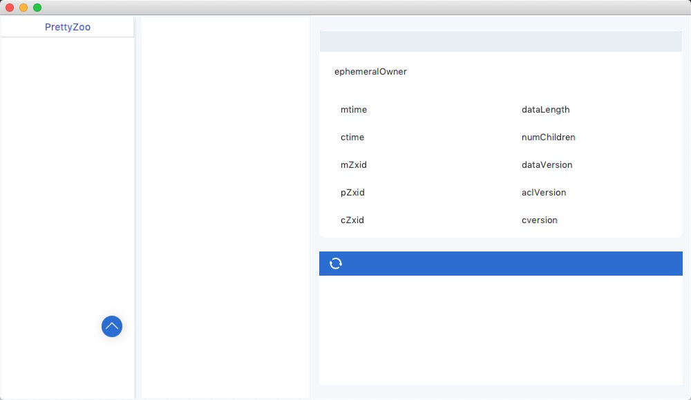
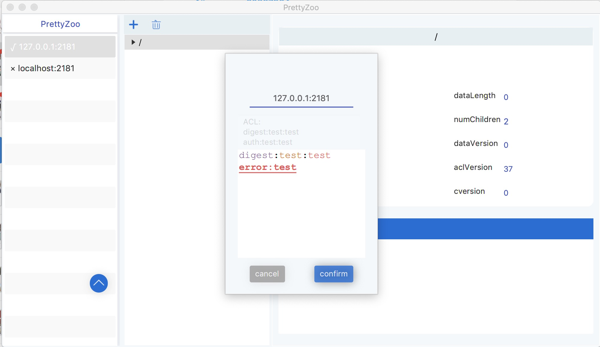
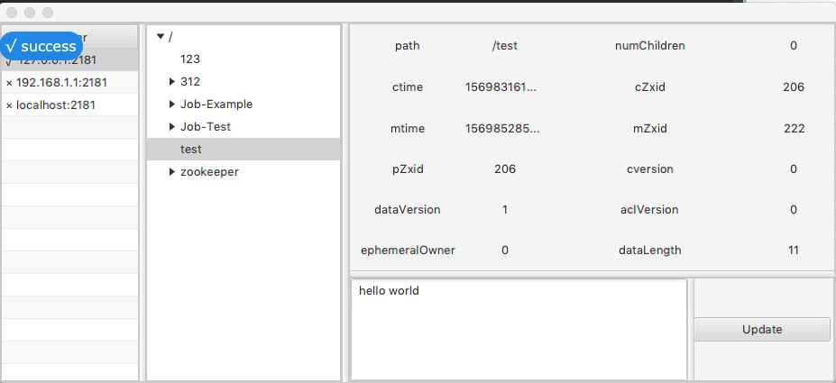
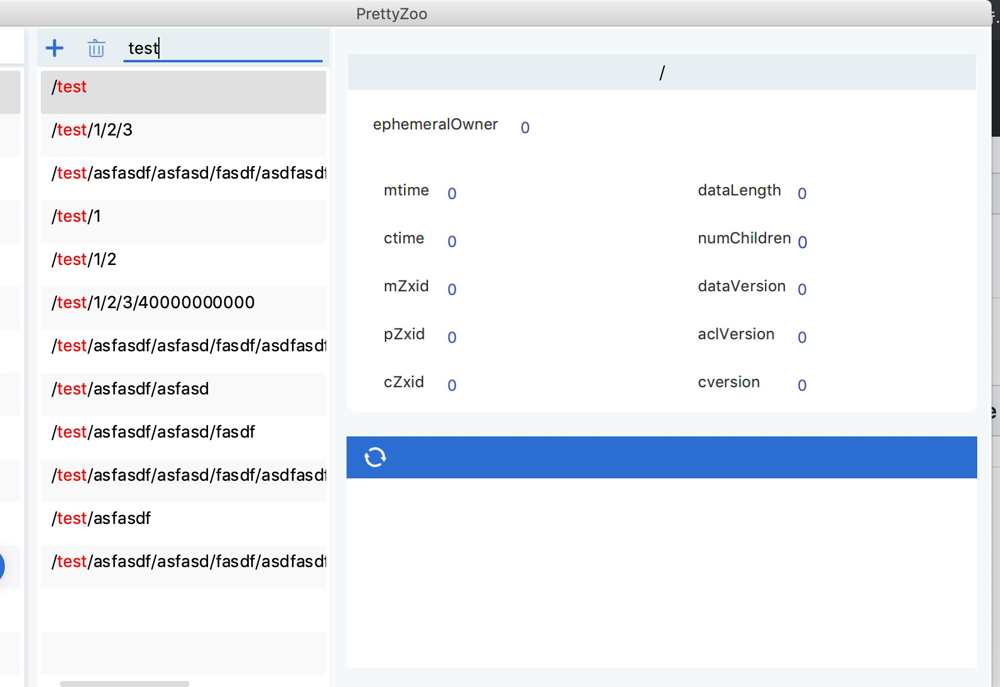
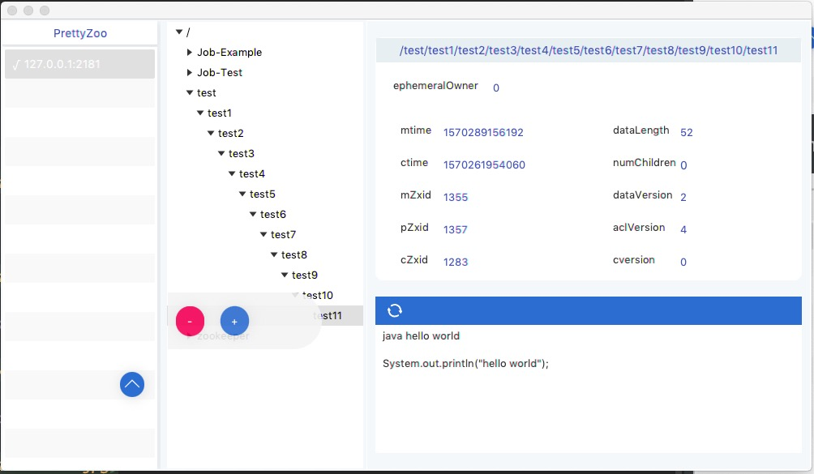
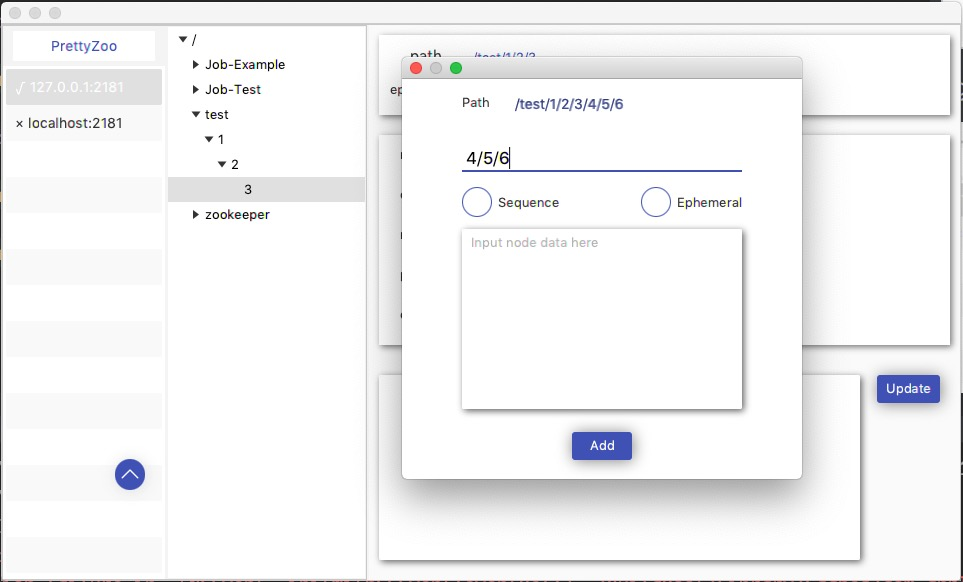

## What

A GUI for Zookeeper created by JavaFX and Curator Framework.

## Requires

-  v0.1.8+, you can install from **IMG** (for mac) without JAVA

> TODO windows you can run  with exe 

- before version v0.1.7,  requires Java 1.8+

## Download and Usage

[Download from Here](https://github.com/vran-dev/PrettyZoo/releases)

- v0.1.8+

> windows: unzip PrettyZoo-win.zip, click bin/prettyZoo.bat to Run

> mac: click PrettyZoo.dmg to install and run

- before v0.1.7
```shell
java -jar PrettyZoo.jar
```

## Features

- connect multi zookeeper server at same time

- remember your server at local

- sync node tree between server and local automatic

- you can recognize different node (persist, ephemeral) by style

- you can add / delete / update node

- recursive mode: add / delete node recursively

- support ACL (simplify) and ACL syntax highlight

- support node search

## TODO

- [x] support node search

- [x] support recursive delete / add (now you can only delete leaf node and add one children)

- [x] support ACL (not satisfied for me now)

- [ ] more strictly check of input, and more friendly reminder

- [ ] installer of OS (exe, img, deb......)

## Example

### Main view





### add server



### Double click to connect and sync



###  node search



### right click item to add / delete node



