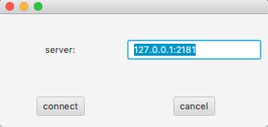
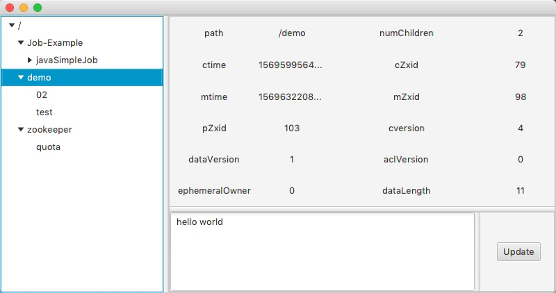

## What

A GUI for Zookeeper created by JavaFX and Curator Framework.

## Requires

- Java 1.8 +

## Download

[Download from Here](release/)

- usage
```shell
java -jar PrettyZoo.jar
```

## TODO

- [x] support dynamic update view

- [x] support update node data

- [ ] different nodes by style

- [ ] support CRD node

- [ ] remember history server and auto suggestion

- [ ] support ACL

## Example






