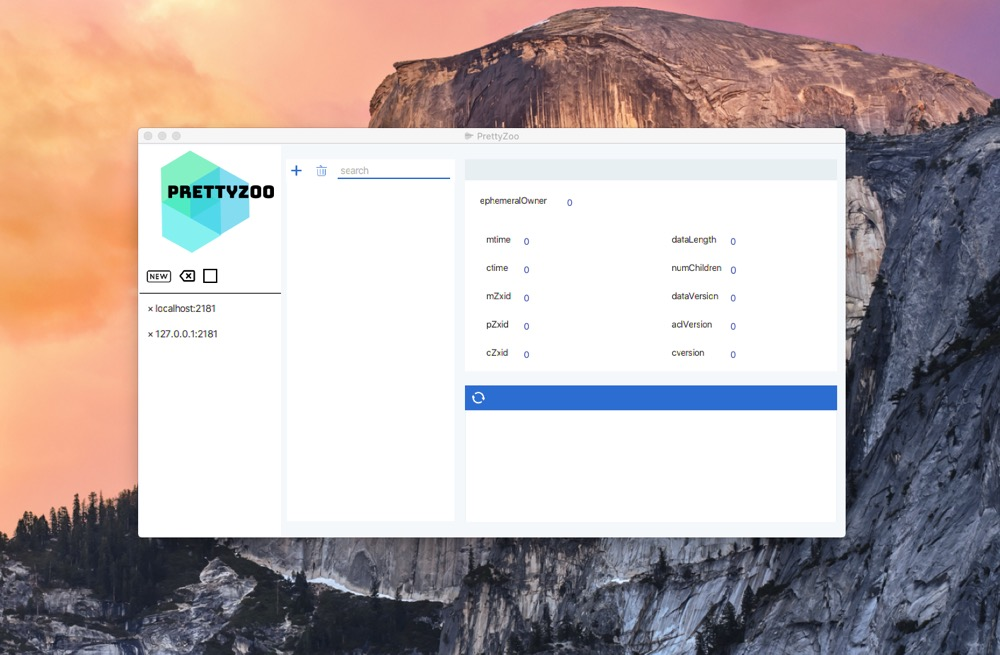
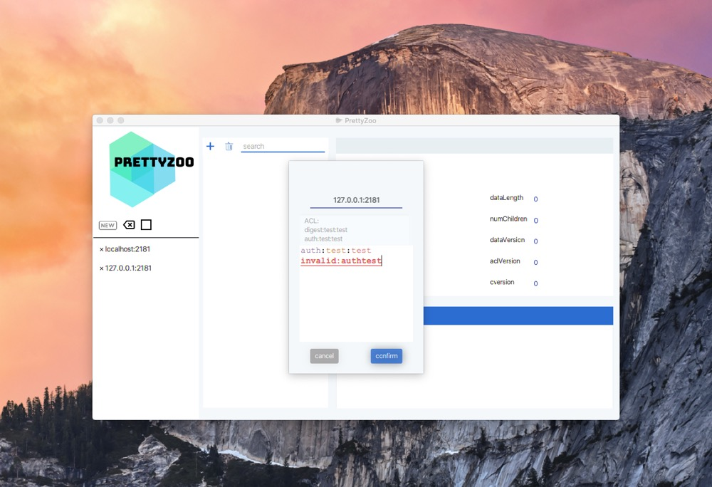
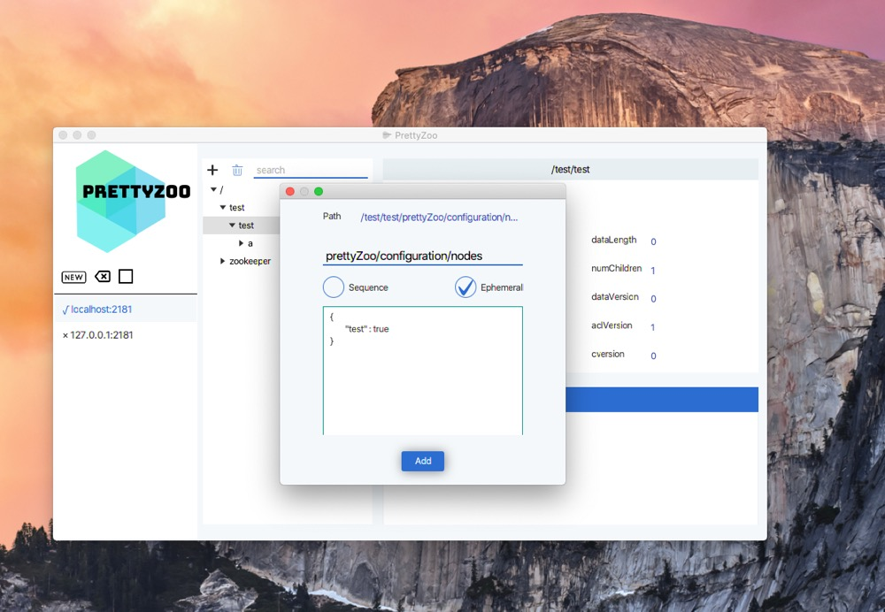
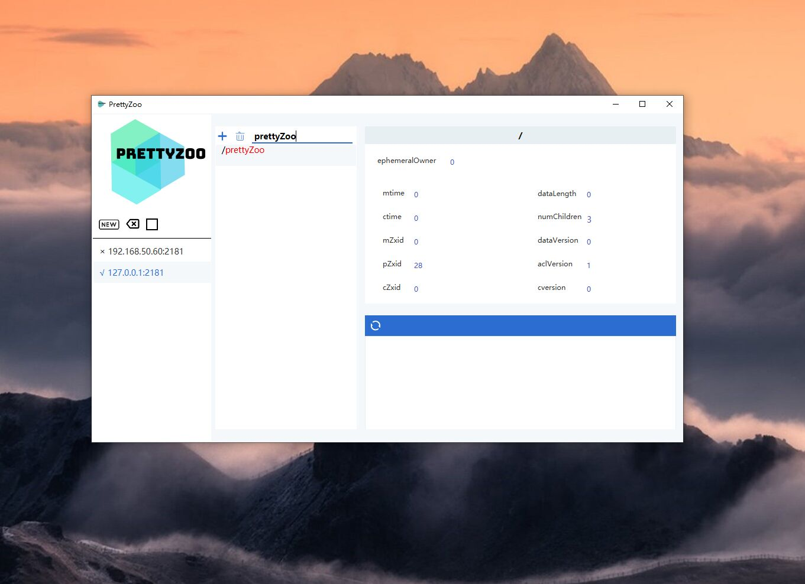
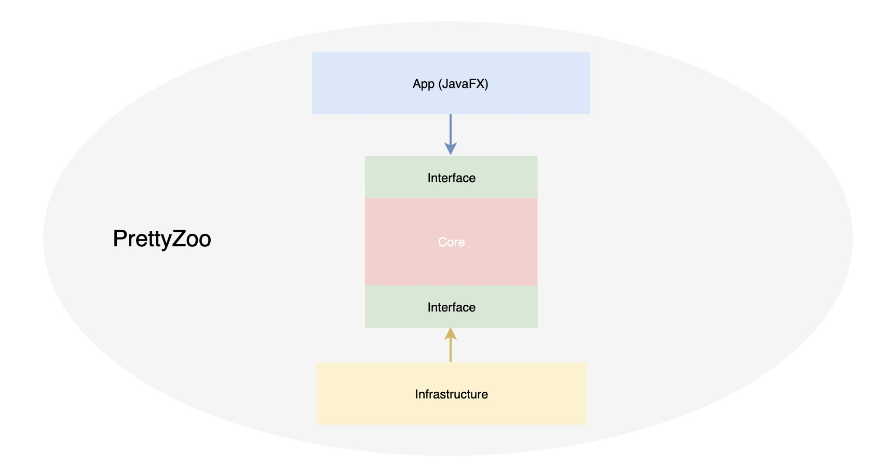
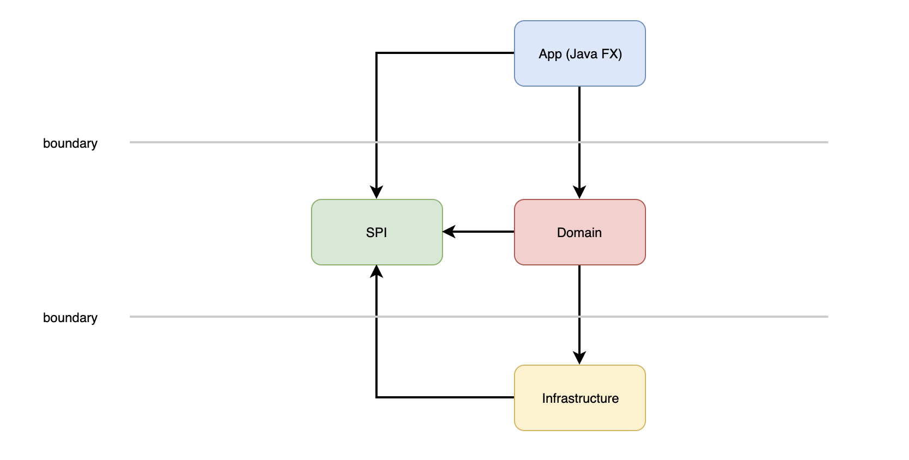

# Language

[中文页面](README_CN.md)

# What

[PrettyZoo](https://github.com/vran-dev/PrettyZoo) is a GUI for [Zookeeper](https://zookeeper.apache.org/) created by JavaFX and Curator Framework。
 
You can download from [Release](https://github.com/vran-dev/PrettyZoo/releases)。

# Require

Nothing, download and run。

# TODO
1. support SSH Tunnel
3. support config export and import
2. support i18n

# Feature

1. Multi zookeeper server manage
2. Auto sync node data 
3. Support recursive add / delete node
4. Support node search
5. Support simple ACL and ACL syntax check
6. Support SSH tunnel

# Show

# Architecture

