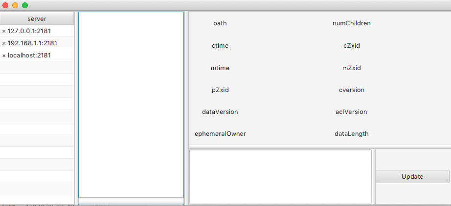

## What

A GUI for Zookeeper created by JavaFX and Curator Framework.

## Requires

- Java 1.8 +

## Download

[Download from Here](https://github.com/vran-dev/PrettyZoo/releases)

- usage
```shell
java -jar PrettyZoo.jar
```

## TODO

- [x] Change UI

- [x] support dynamic update view

- [ ] different nodes by style

- [ ] node search

- [x] support `CRUD` node

- [x] remember history server

- [ ] support ACL

- [ ] support Proxy

- [ ] error log

## Example

### Main view


### Right click to add server





### delete node


### add node


