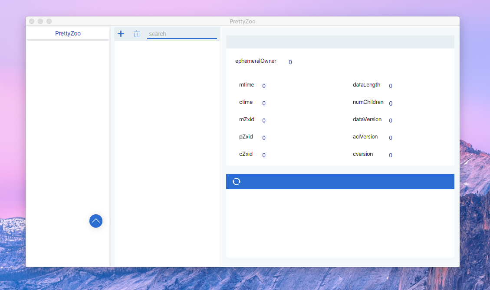
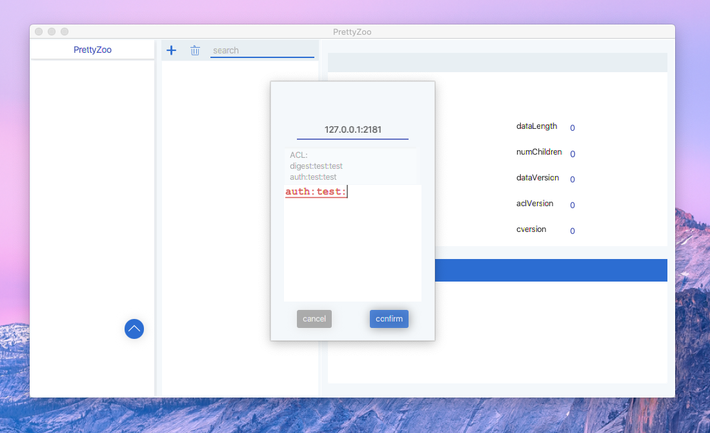
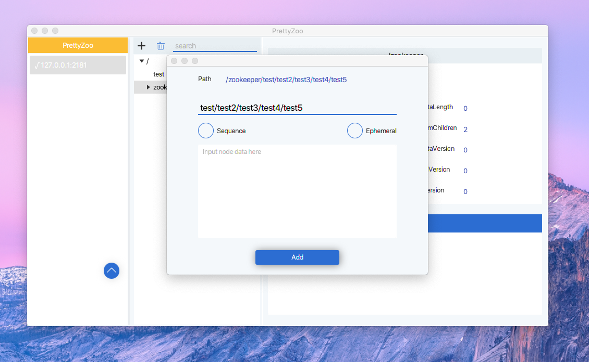
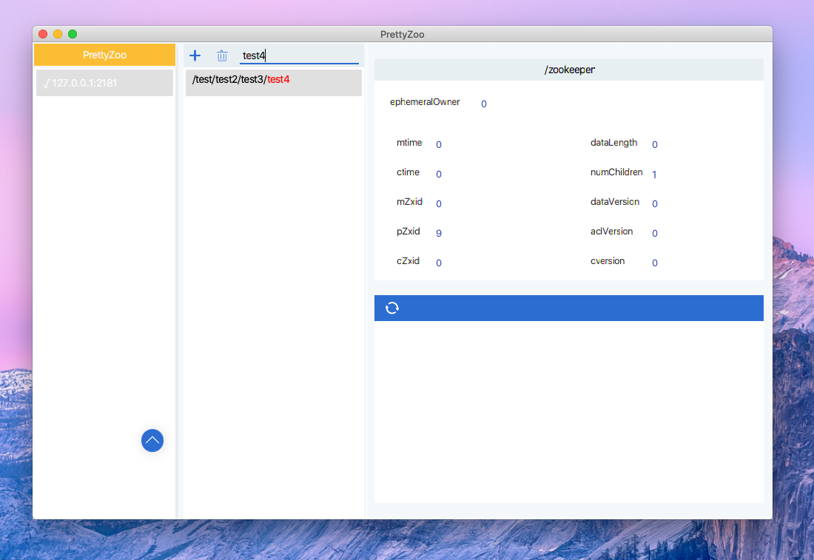

# What

[PrettyZoo](https://github.com/vran-dev/PrettyZoo) is an GUI for [Zookeeper](https://zookeeper.apache.org/) created by JavaFX and Curator Framework, You can download from [Release](https://github.com/vran-dev/PrettyZoo/releases)。

# Require

Nothing, download and run。

# Feature

1. Multi zookeeper server manage
2. Auto sync node data 
3. Support recursive add / delete node
4. Support node search
5. Support simple ACL and ACL syntax check

# Show

# Architecture

