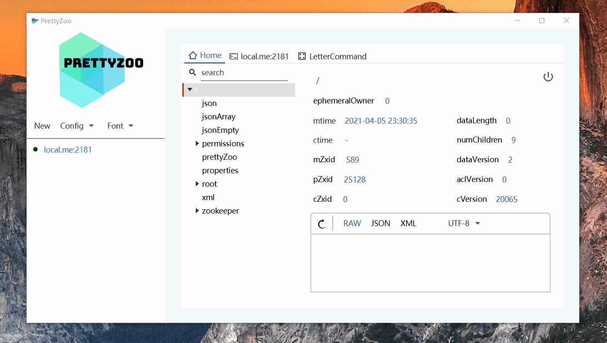
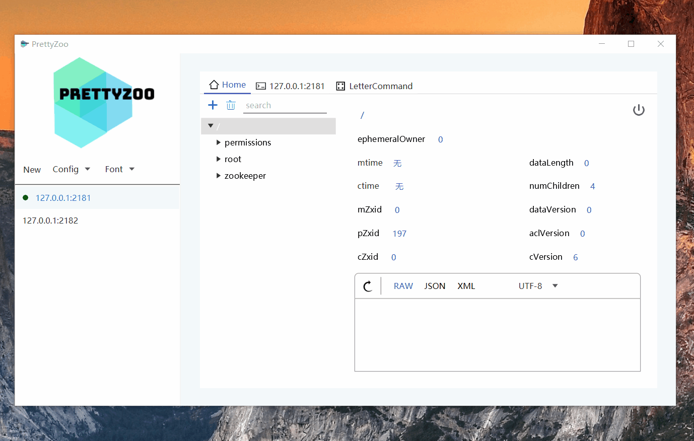
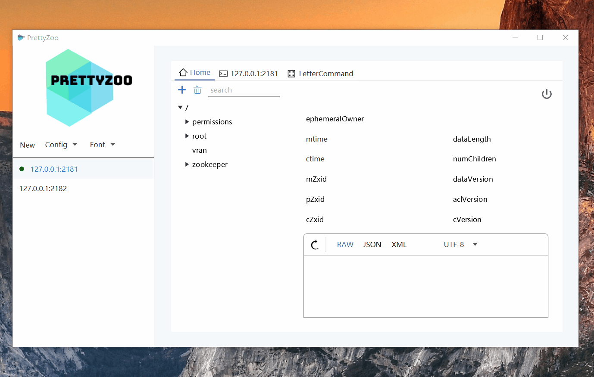

    

    

# Language

English |  [中文](README_CN.md)

# What

[PrettyZoo](https://github.com/vran-dev/PrettyZoo) is a GUI for [Zookeeper](https://zookeeper.apache.org/) created by JavaFX and Apache Curator Framework.

You can download and install at [Release](https://github.com/vran-dev/PrettyZoo/releases),  support

- Windows (msi)
- Mac (dmg)
- Linux (rpm & deb)

# TODO

1. - [ ] Support i18n
2. - [ ] command highlight
3. - [x] global font size change

# Feature

1. Multi zookeeper server manage
2. Support real-time node synchronize
3. Support ACL
4. Support SSH tunnel
5. Support config export /  import
6. Support node create / search / update / delete
7. Support terminal operation
8. Support **JSON** / **XML** data pretty format

# Show

- over view

- server info

- node info

- node add

- node search

- terminal

- 4-letter

## Thanks

- [ZooKeeper GUI 客户端](http://vip.iocoder.cn/Zookeeper/PrettyZoo/)  by 「芋道源码」

- [PrettyZoo, 颜值与功能双在线的 Zookeeper 可视化工具](https://mp.weixin.qq.com/s/TkFirILto_moEv_kjBBPFw)