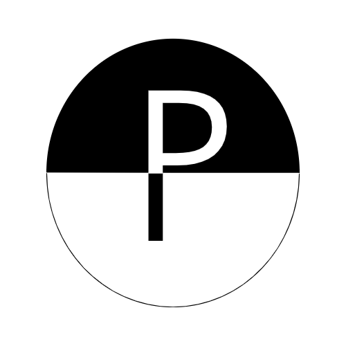
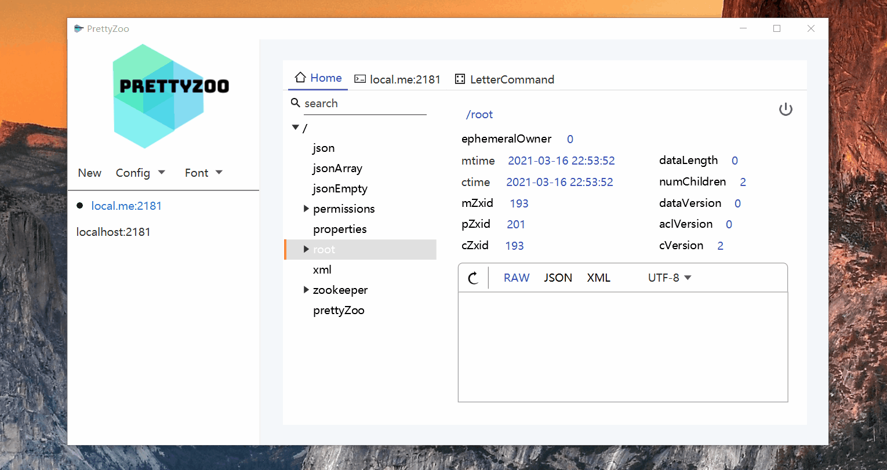

<p align="center">
    
</p>


    

# Language

English |  [中文](README_CN.md)

# Supported by

[Jetbrains](https://www.jetbrains.com/)


# What

[PrettyZoo](https://github.com/vran-dev/PrettyZoo) is a GUI for [Zookeeper](https://zookeeper.apache.org/) created by JavaFX and Apache Curator Framework.

You can download and install at [Release](https://github.com/vran-dev/PrettyZoo/releases),  support

- Windows (msi)
- Mac (dmg)
- Linux (rpm & deb)

## If you see PrettyZoo is damaged  in Mac

you can see the solution in [issue-219](https://github.com/vran-dev/PrettyZoo/issues/219)

1. run the follow command

```shell
sudo spctl --master-disable
```

2. open System Preferences->Security & Privacy, select **anywhere**
3. run the follow command

```shell
xattr -rc /Applications/prettyZoo.app
```

4. Enjoy it

### How to add zookeeper system properties

If you want to configure system properties for zookeeper, you could creat `zookeeper.properties` file

- mac: `{{ user.home }}/.prettyZoo/zookeeper.properties`
- wind: `{{ user.home }}/.prettyZoo/zookeeper.properties`
- linux: `{{ user.home }}/.prettyZoo/zookeeper.properties`

such as follow content

```properties
jute.maxbuffer=1000000
```

prettyZoo will load and set it to system properties when application start

> note: the `zookeeper.properties` will work for all server.

# TODO

1. - [x] Support i18n (V1.9.0+)
2. - [ ] terminal highlight
3. - [x] global font size change (v1.6.0+)
4. - [x] node data highlight (V1.7.0+)
5. - [x] migration UI library to   [Jfoenix](https://github.com/sshahine/JFoenix) ( V1.8.0+)
6. - [ ] zookeeper monitor
7. - [x] log dashboard (v1.9.3)

# Feature

1. Multi zookeeper server manage
2. Support real-time node synchronize
3. Support ACL
4. Support SSH tunnel
5. Support config export /  import
6. Support node create / search / update / delete
7. Support terminal operation
8. Support **JSON** / **XML** data pretty format
9. Support node data hightlight ( Json / Xml / Properties )
10. Support reconnet zookeeper automatic

## Build

See wiki: [build yourself](https://github.com/vran-dev/PrettyZoo/wiki/build-yourself)

# Sponsor

By wechat sponsor code


# Show

- over view


- server info 


- node data highlight


- node info



- node add 


- node search


- terminal


- 4-letter


## Thanks

- [ZooKeeper GUI 客户端](http://vip.iocoder.cn/Zookeeper/PrettyZoo/)  by 「芋道源码」

- [PrettyZoo, 颜值与功能双在线的 Zookeeper 可视化工具](https://mp.weixin.qq.com/s/TkFirILto_moEv_kjBBPFw)