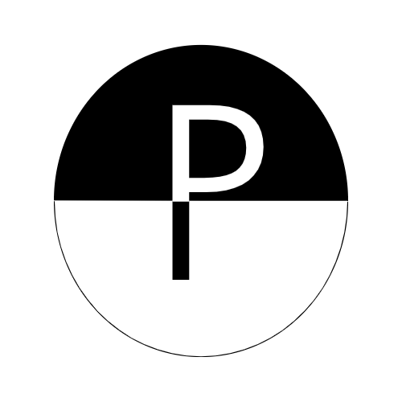
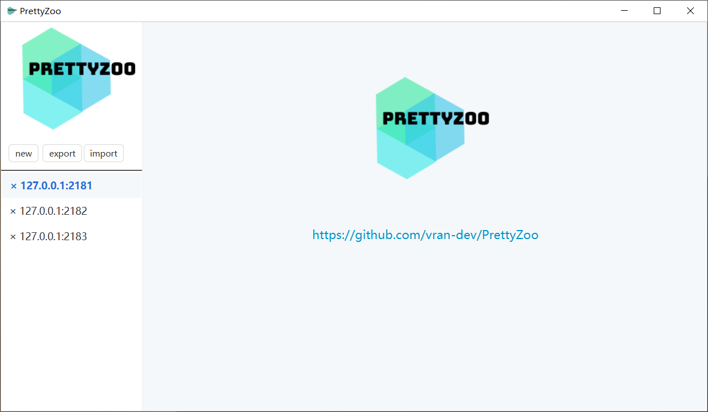
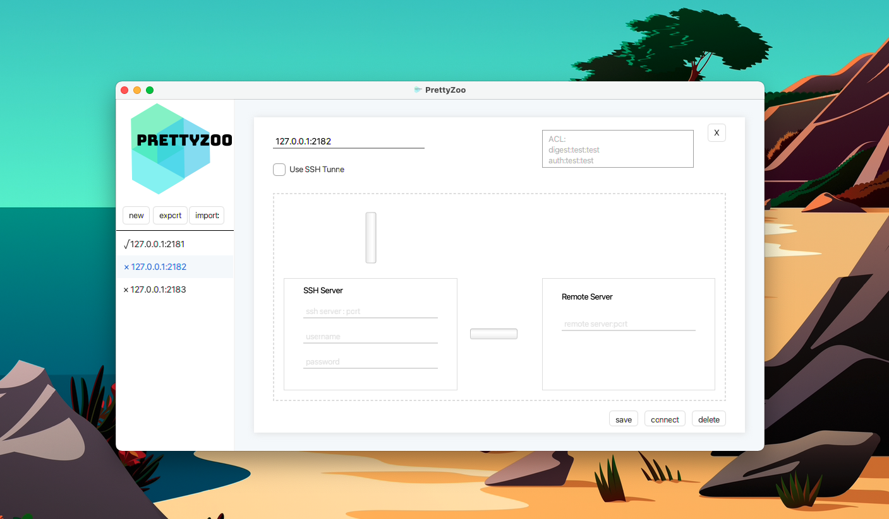
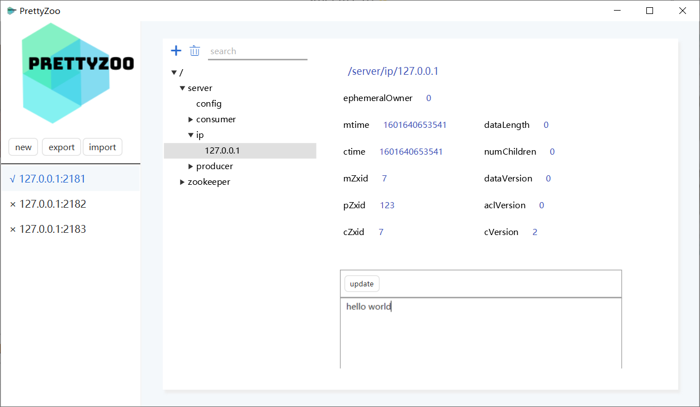
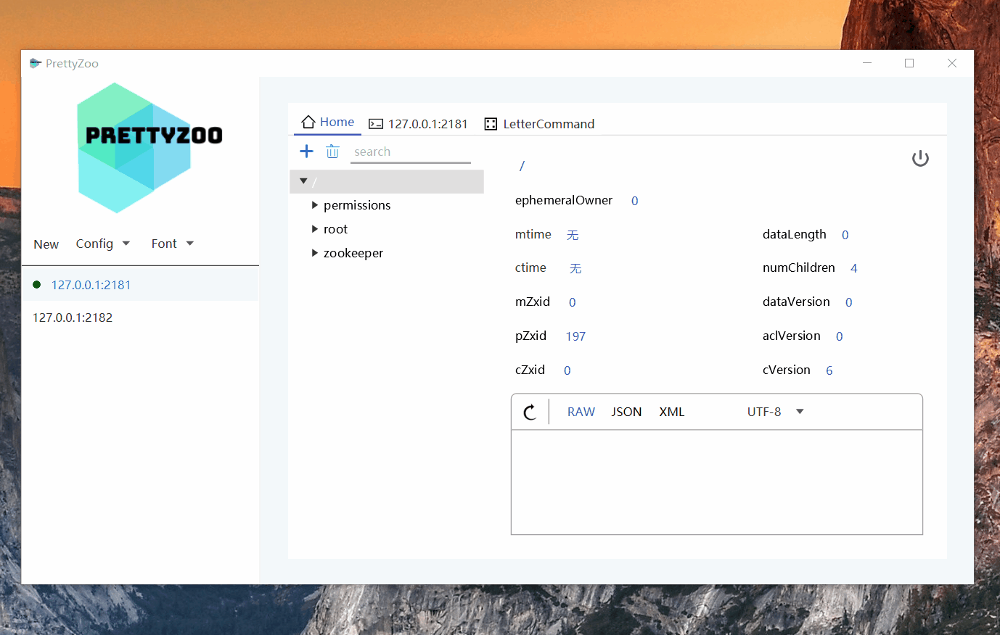
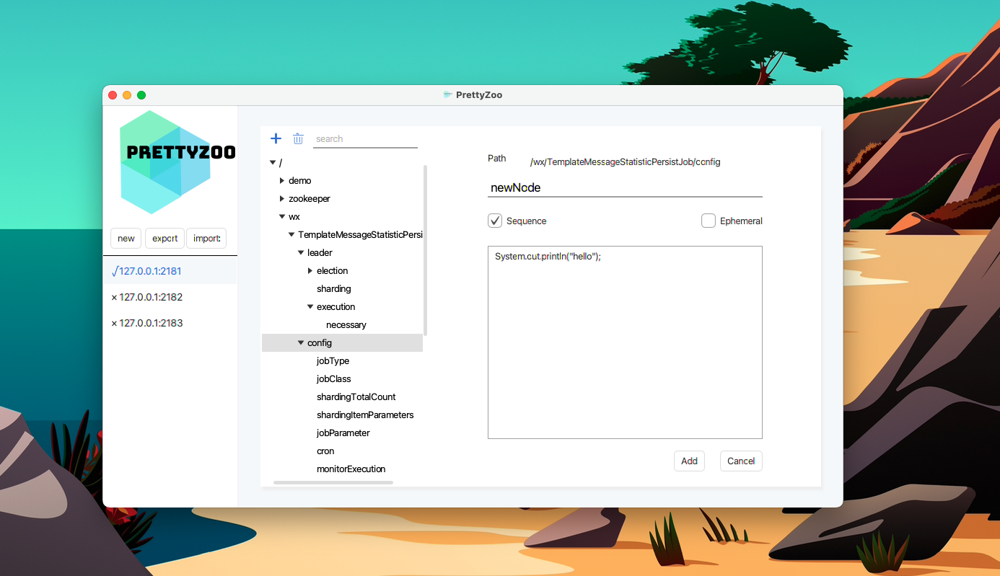
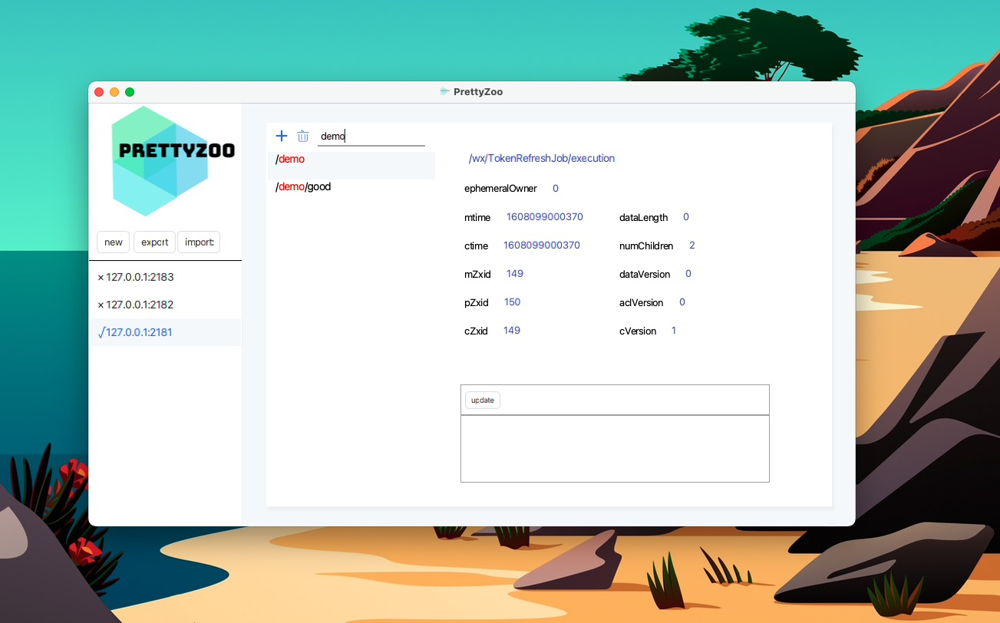
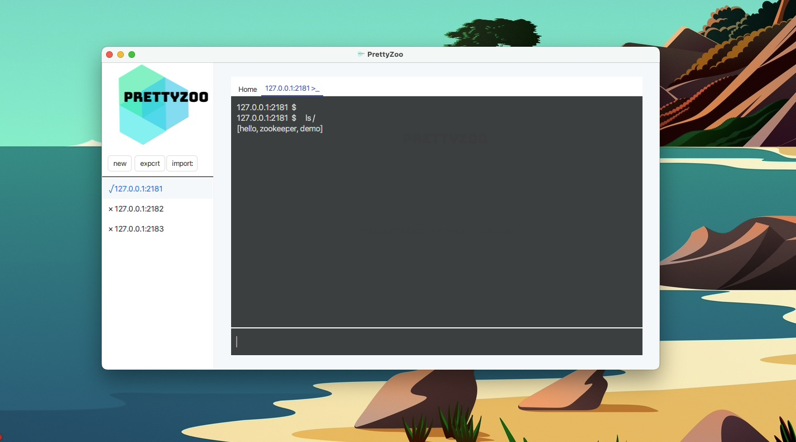
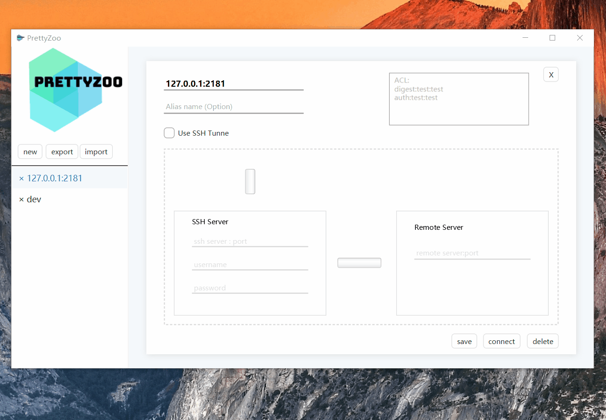

    

    

# 语言

[English](README.md)

# 介绍

[PrettyZoo](https://github.com/vran-dev/PrettyZoo) 是一个基于 Apache Curator 和 JavaFX 实现的 Zookeeper 图形化管理客户端。

使用了 Java 的模块化（Jigsaw）技术，并基于 JPackage 打包了多平台的可运行文件（无需要额外安装 Java 运行时）。

目前已提供了 mac（dmg 文件）、Linux（deb 和 rpm 文件）、windows（msi 文件） 的安装包，[下载地址](https://github.com/vran-dev/PrettyZoo/releases)。

# MAC 安装问题

mac 安装提示：已损坏，无法打开

请参考 https://www.macwk.com/article/mac-catalina-1015-file-damage  解决

本质是因为安装包打包时没有加入 apple 平台的签名，我会在后续寻找解决方案

# 规划

1、支持国际化

2、<del>支持版本检查</del> v1.1.0

3、<del>支持断开连接</del> v1.1.0

4、<del>支持命令行操作</del> v1.2.0-BETA

5、支持数据字符集切换

6、重构 ......

# 特性

1、可同时管理多个 zookeeper 连接

2、节点数据实时同步

3、支持节点增删改查

4、支持简单的 ACL，以及 ACL 语法检查

5、支持 SSH Tunnel

6、支持配置导入和导出

7、命令行操作

# 界面展示

- 主页面

- server 配置

- 节点详情页面

- 创建节点

- 节点搜索

- 命令行

# 感谢

- 感谢「芋道源码」对 PrettyZoo 的推荐: [ZooKeeper GUI 客户端](http://vip.iocoder.cn/Zookeeper/PrettyZoo/)

