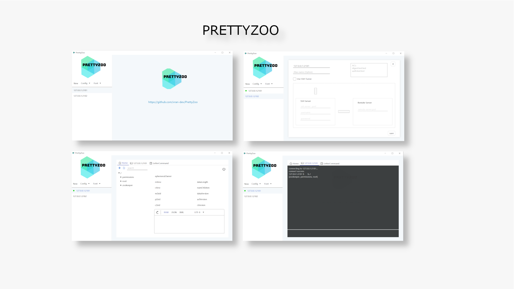

    

    

# 语言

[English](README.md)  | 中文

# 介绍

[PrettyZoo](https://github.com/vran-dev/PrettyZoo) 是一个基于 Apache Curator 和 JavaFX 实现的 Zookeeper 图形化管理客户端。

使用了 Java 的模块化（Jigsaw）技术，并基于 JPackage 打包了多平台的可运行文件（无需要额外安装 Java 运行时）。

目前已提供了 mac（dmg 文件）、Linux（deb 和 rpm 文件）、windows（msi 文件） 的安装包，[下载地址](https://github.com/vran-dev/PrettyZoo/releases)。

# MAC 安装问题

mac 安装提示：已损坏，无法打开

请参考 https://www.macwk.com/article/mac-catalina-1015-file-damage  解决

本质是因为安装包打包时没有加入 apple 平台的签名，我会在后续寻找解决方案

# 规划

1. 国际化支持
2. <del>重构节点搜索功能</del>
3. 节点数据支持编码切换

# 特性

1. 可同时管理多个 zookeeper 连接
2. 节点数据实时同步
3. 支持 ACL 配置
4. 支持 SSH Tunnel 连接
5. 支持配置导入、导出
6. 支持节点增删改查操作
7. 支持 command line 操作模式
8. 支持节点数据格式化 JSON、XML

# 界面展示

- 主页面

- server 配置

- 节点详情页面

- 创建节点

- 节点搜索

- 命令行

# 感谢

- 感谢「芋道源码」对 PrettyZoo 的推荐: [ZooKeeper GUI 客户端](http://vip.iocoder.cn/Zookeeper/PrettyZoo/)

